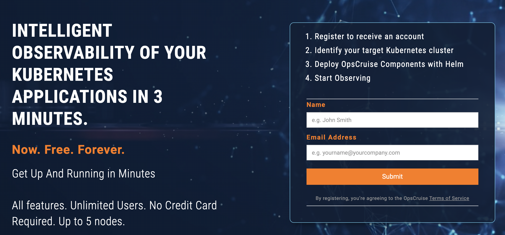
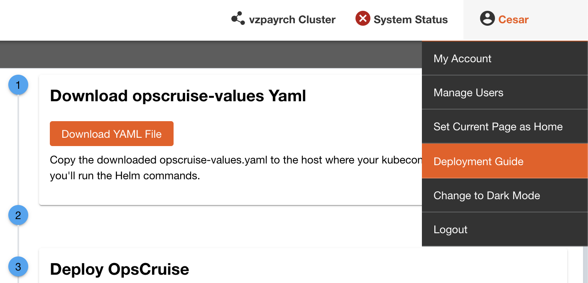
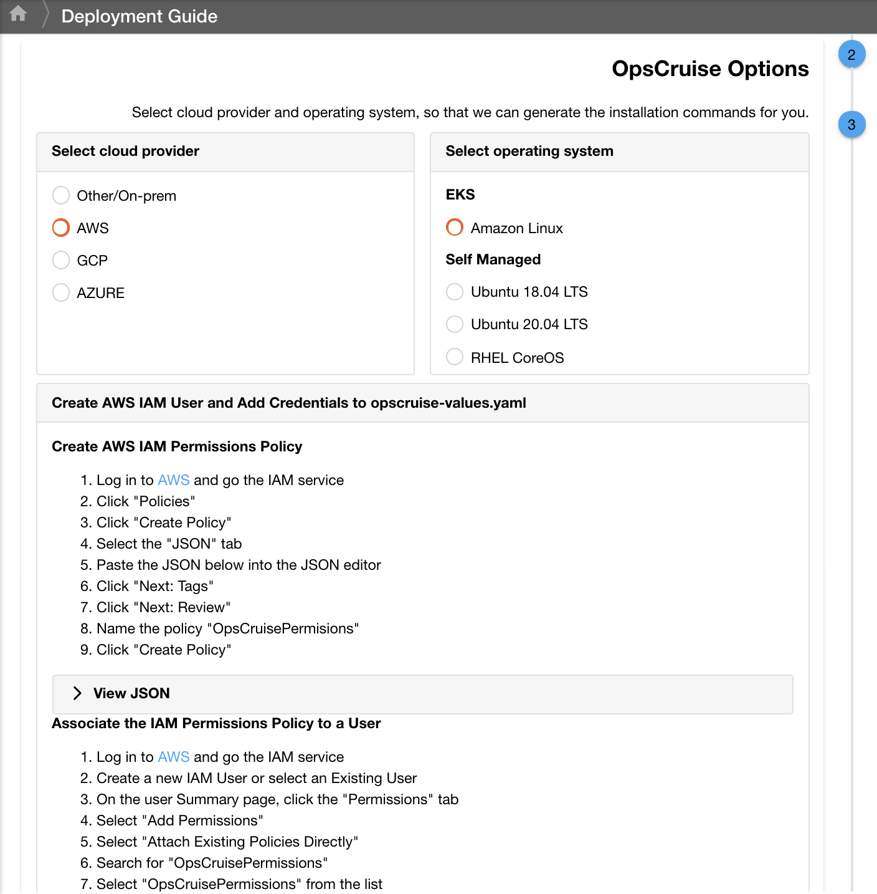

# Deploy EKS Cluster with Worker Nodes in Wavelength Zone

These commands can be run either through the aws cli (download here: https://docs.aws.amazon.com/cli/latest/userguide/getting-started-install.html) or by uploading the cloud formation script into the AWS CloudFormation UI and providing the Parameters.

# Getting Started
1. Go to https://opscruise.com/free-forever and sign up for an OpsCruise account.



2. Once your OpsCruise instance has been created, log in to your OpsCruise instance
3. Click on your **user name** in the upper right corner, then **Deployment Guide**
4. Click on **Download YAML File**



5. In Section 2 of the Deployment guide, select **AWS**, then **Amazon Linux**, and follow the instructions to create an IAM role in order to allow OpsCruise to query AWS



6. Upload your opscruise-values.yaml to an S3 bucket and have the URL handy (you’ll need it in Step 7)
7. Run the following command:


NOTE: The stack-name assumes linux for substitution; replace \$(date +%b%d%Y_%H%M) as needed. Also, replace OpsCruiseValuesURL, EKSClusterAdminArn, and EKSClusterAdminArn ParameterValues with your actual values.

```

aws cloudformation create-stack \
    --stack-name eksCluster-wOpsCruise-$(date +%b%d%Y_%H%M) \
    --template-url https://wavelength-cloudformation-templates.s3.us-west-2.amazonaws.com/wavelength-eksCluster-withOpsCruise.yaml \
    --disable-rollback \
    --capabilities CAPABILITY_NAMED_IAM \
    --parameters \
        ParameterKey=OpsCruiseValuesURL,ParameterValue="$S3_URL_TO_VALUES.YAML" \
        ParameterKey=EKSClusterAdminArn,ParameterValue=$USER_ARN
        ParameterKey=EKSClusterAdminName,ParameterValue=$USER_NAME